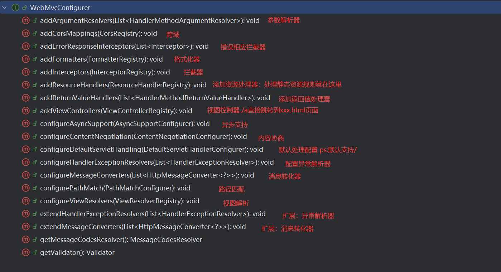

# Springboot3 web

#### 1. 与web场景有关的自动配置类

```properties
org.springframework.boot.autoconfigure.data.web.SpringDataWebAutoConfiguration

org.springframework.boot.autoconfigure.web.client.RestClientAutoConfiguration
org.springframework.boot.autoconfigure.web.client.RestTemplateAutoConfiguration
org.springframework.boot.autoconfigure.web.embedded.EmbeddedWebServerFactoryCustomizerAutoConfiguration
===========================================响应式编程里的内容==================================================
org.springframework.boot.autoconfigure.web.reactive.HttpHandlerAutoConfiguration
org.springframework.boot.autoconfigure.web.reactive.ReactiveMultipartAutoConfiguration
org.springframework.boot.autoconfigure.web.reactive.ReactiveWebServerFactoryAutoConfiguration
org.springframework.boot.autoconfigure.web.reactive.WebFluxAutoConfiguration
org.springframework.boot.autoconfigure.web.reactive.WebSessionIdResolverAutoConfiguration
org.springframework.boot.autoconfigure.web.reactive.error.ErrorWebFluxAutoConfiguration
org.springframework.boot.autoconfigure.web.reactive.function.client.ClientHttpConnectorAutoConfiguration
org.springframework.boot.autoconfigure.web.reactive.function.client.WebClientAutoConfiguration
==========================================================================================================
org.springframework.boot.autoconfigure.web.servlet.DispatcherServletAutoConfiguration
org.springframework.boot.autoconfigure.web.servlet.ServletWebServerFactoryAutoConfiguration
org.springframework.boot.autoconfigure.web.servlet.error.ErrorMvcAutoConfiguration
org.springframework.boot.autoconfigure.web.servlet.HttpEncodingAutoConfiguration
org.springframework.boot.autoconfigure.web.servlet.MultipartAutoConfiguration
org.springframework.boot.autoconfigure.web.servlet.WebMvcAutoConfiguration
org.springframework.boot.autoconfigure.websocket.reactive.WebSocketReactiveAutoConfiguration
org.springframework.boot.autoconfigure.websocket.servlet.WebSocketServletAutoConfiguration
org.springframework.boot.autoconfigure.websocket.servlet.WebSocketMessagingAutoConfiguration
org.springframework.boot.autoconfigure.webservices.WebServicesAutoConfiguration
org.springframework.boot.autoconfigure.webservices.client.WebServiceTemplateAutoConfiguration
```

#### 2. 绑定配置文件的配置项

- spring.mvc    SpringMVC的所有配置
- spring.web    Web场景通用配置  
- spring.servlet.multipart    文件上传配置
- server   服务器相关配置

#### 3. Spring MVC

#####  自动配置

Spring Boot 为 Spring MVC 提供了自动配置，适用于大多数应用程序。它取代了 @EnableWebMvc 的使用，并且两者不能同时使用。除了 Spring MVC 的默认设置外，自动配置还提供了以下功能：

•  包含 ContentNegotiatingViewResolver 和 BeanNameViewResolver 两个 bean。
• 支持静态资源的提供，包括对 WebJars 的支持（在本文档的后面部分会介绍）。
• 自动注册 Converter、GenericConverter 和 Formatter 类型的 bean。
• 支持 HttpMessageConverters（在本文档的后面部分会介绍）。
• 自动注册 MessageCodesResolver（在本文档的后面部分会介绍）。
• 支持静态 index.html 文件。
• 自动使用 ConfigurableWebBindingInitializer 类型的 bean（在本文档的后面部分会介绍）。

- 如果您希望保留 Spring Boot MVC 的自定义设置并进行更多的 MVC 自定义设置（interceptors, formatters, view controllers, and other features），可以添加您自己的 WebMvcConfigurer 类型的 @Configuration 类，但不要使用 @EnableWebMvc
- 如果您想要提供自定义的 RequestMappingHandlerMapping、RequestMappingHandlerAdapter 或 ExceptionHandlerExceptionResolver 实例，同时仍保留 Spring Boot MVC 的自定义设置，您可以声明一个类型为 WebMvcRegistrations 的 bean，并使用它来提供这些组件的自定义实例。这些自定义实例将接受 Spring MVC 的进一步初始化和配置。若要参与并（如有需要）覆盖后续处理，应使用 WebMvcConfigurer。
- 如果您不想使用自动配置并完全掌控 Spring MVC，可以添加一个带有 @EnableWebMvc 注解的 @Configuration 类。或者，按照 @EnableWebMvc API 文档中的说明添加一个带有 @Configuration 注解的 DelegatingWebMvcConfiguration 类。

##### 三种方式:

| 全自动         | 直接编写控制逻辑                                             | 全部使用自动配置默认效果  |                                       |
| :------------- | ------------------------------------------------------------ | ------------------------- | ------------------------------------- |
| ***手动一体*** | ***@Configuration + <br />配置WebMvcConfigurer + <br />配置 WebMvcRegistrations*** | ***不使用@EnableWebMvc*** | ***手动设置部分功能定义MVC底层组件*** |
| 全手动         | @Configuration + <br />配置WebMvcConfigurer                  | 标注@EnableWebMvc         | 禁用自动配置效果<br />全部手动设置    |

手自一体（最常用）：给项目写一个配置类，实现WebMvcConfigurer接口，实现它的部分接口，不标注@EnableWebMvc

##### 两个模式

- 前后端分离模式： @RestController响应JSON数据
- 前后端不分离： @Controller + Thymeleaf模式引擎

##### WebMvcAutoConfiguration源码解析

- 生效条件

```java
@AutoConfiguration(after = { DispatcherServletAutoConfiguration.class, TaskExecutionAutoConfiguration.class,
       ValidationAutoConfiguration.class }) // 在这些配置类之后生效
@ConditionalOnWebApplication(type = Type.SERVLET) // 只有是web应用才生效，类型还得是servlet（区别于reaction编程）
@ConditionalOnClass({ Servlet.class, DispatcherServlet.class, WebMvcConfigurer.class })
@ConditionalOnMissingBean(WebMvcConfigurationSupport.class)//容器中没有才会生效，为自定义提供了方便
@AutoConfigureOrder(Ordered.HIGHEST_PRECEDENCE + 10)//优先级
@ImportRuntimeHints(WebResourcesRuntimeHints.class)
```

- 两个Filter

  - hiddenHttpMethodFilter	页面表单提交REST请求
  - formContentFilter      表单内容过滤  GET POST请求可以携带数据，PUT DELETE等携带的数据会被会略

- 给容器中放了WebMvcConfigurer组件，给SpringMVC添加各种功能组件

  - ```java
    @Configuration(proxyBeanMethods = false)
    @Import(EnableWebMvcConfiguration.class)
    @EnableConfigurationProperties({ WebMvcProperties.class, WebProperties.class })
    @Order(0)
    public static class WebMvcAutoConfigurationAdapter implements WebMvcConfigurer, ServletContextAware {}
    ```

  - WebMvcConfigurer接口方式及其功能

  - 

